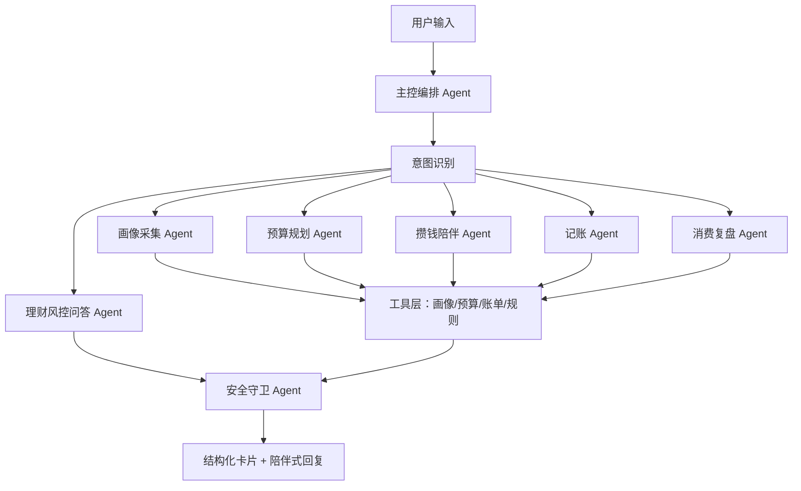

# 省心喵 H5 Demo

这是“省心喵”比赛 demo 的最小可体验版本：移动端 H5 前端 + Node 后端 + 多 Agent 编排 + DeepSeek API 调用。

## 本地启动

```bash
cd demo
cp .env.example .env
```

在 `.env` 中填入 DeepSeek API Key 后启动：

```bash
npm run dev
```

浏览器打开：

```text
http://localhost:3000
```

## 环境变量

| 变量 | 说明 |
| --- | --- |
| `DEEPSEEK_API_KEY` | DeepSeek API Key |
| `DEEPSEEK_BASE_URL` | DeepSeek API 基础地址，默认 `https://api.deepseek.com` |
| `DEEPSEEK_MODEL` | 模型名称，默认 `deepseek-chat` |
| `PORT` | 本地端口，默认 `3000` |
| `HOST` | 监听地址，本地默认 `127.0.0.1`，部署时可设为 `0.0.0.0` |

没有配置 `DEEPSEEK_API_KEY` 时，后端会明确返回 `source: "fallback"` 和 `fallbackReason: "missing_api_key"`，前端显示“未连接”。配置 Key 并重启服务后，所有用户真实输入都会优先发送到 Chat Completions API，规则结果只作为金额计算和卡片结构参考。

## 多 Agent 架构



## API 调用链路

```text
H5 前端
  -> POST /api/chat
  -> 主控编排 Agent 判断 intent
  -> 对应子 Agent 构造 prompt
  -> DeepSeek Chat Completions API
  -> 安全守卫校验
  -> 返回 JSON 给前端渲染卡片
```
