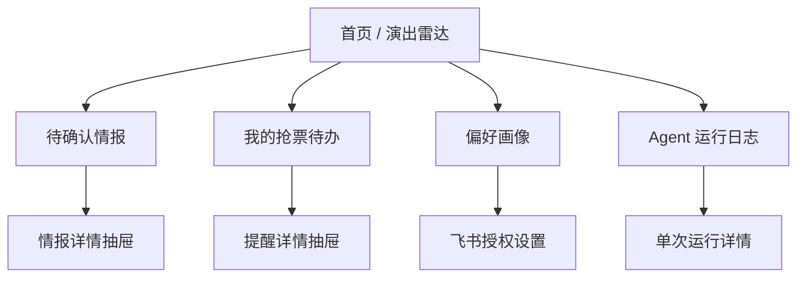
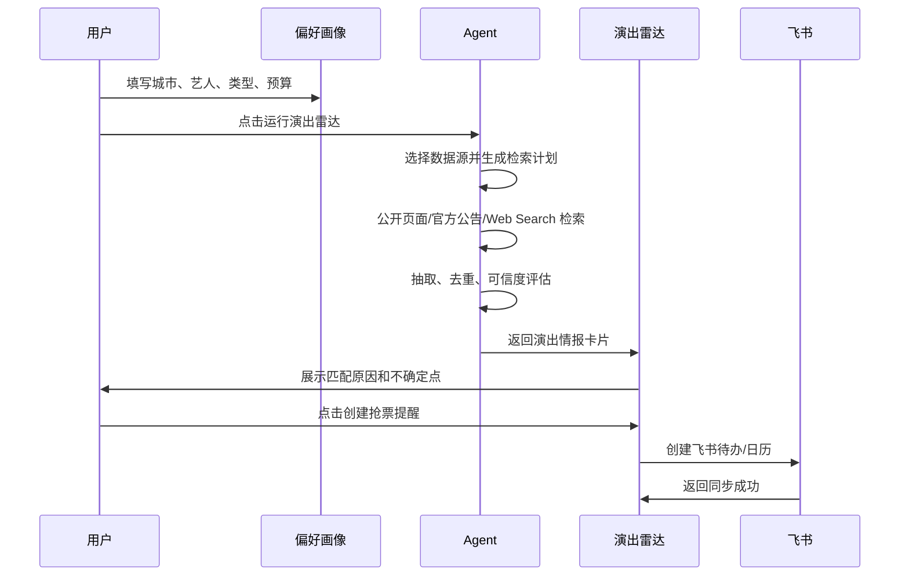

# 打工人的演出自救 Agent：产品原型设计

版本：v0.1  
日期：2026-05-11  
对应 PRD：`打工人的演出自救Agent_MVP_PRD.md`  
产品形态：高质感 Web App + 移动端适配 + PWA 预留

---

## 1. 原型设计目标

本原型面向比赛 MVP，目标不是做一个“能填表的后台”，而是做一个可演示、可理解、能体现 Agent 工作流的票务情报助理。

核心设计原则：

- 用户订阅的是“兴趣”，不是手动维护信息源。
- Agent 负责从大麦公开页面、官方演出页面、剧场官网、艺人公告和 Web Search 中发现、整理、解释情报，用户保留最终决定权。
- 所有关键动作都要形成闭环：发现情报 → 用户确认 → 创建飞书提醒。
- 前端需要有质感，适合比赛现场直接展示。
- 界面要能解释技术能力，让评委看得见 Agent 在工作。

---

## 1.1 大麦 API 调研后的产品调整

调研结论：

- 阿里/飞猪开放平台存在“大麦票务云分销 API”，包含项目列表、项目详情、项目状态等接口，例如 `alibaba.damai.maitix.projectlists.query`、`alibaba.damai.maitix.project.distribution.detail.query`。
- 这类接口更偏向商家、分销或授权项目查询，不等同于面向普通开发者开放的全量消费者端演出搜索 API。
- 当前项目以普通个人开发者身份实现，拿不到大麦官方 API 授权，因此 MVP 不直接调用大麦开放接口。
- 架构上仅预留“大麦官方授权接口适配层”，作为未来企业合作或获得授权后的扩展能力。
- 实际 MVP 使用“大麦公开页面 / 官方演出页面 / 剧场官网 / 艺人公告”作为第一优先级信息来源，再使用 Web Search 做多源补充。

产品侧调整：

- “Web Search Skill”升级为“票务情报检索 Skill”。
- 演出卡片增加“来源类型”：大麦公开页面、官方演出页面、剧场官网、艺人公告、Web Search、社交媒体、媒体报道。
- 可信度展示中，大麦公开页面、官方演出页面、剧场官网、艺人公告权重最高。
- 运行日志中展示不同数据源的命中数量，突出工程链路和合规边界。

参考链接：

- https://open.fliggy.com/docs/api.htm?apiId=42624
- https://open.fliggy.com/docs/api.htm?apiId=45916

---

## 2. 信息架构



一级导航：

- 演出雷达
- 待确认
- 抢票待办
- 偏好画像
- 运行日志

推荐布局：

- 桌面端：左侧固定导航 + 主内容区 + 右侧详情/状态栏。
- 移动端：底部 Tab 导航 + 卡片流 + 全屏详情弹层。

---

## 3. 整体视觉方向

关键词：

- 城市夜生活
- 情报雷达
- 个人工作台
- 演出票根
- 清爽但有舞台感

视觉建议：

- 主背景：深色夜间底色，不做纯黑，避免压抑。
- 内容区域：使用半透明深灰面板或浅色卡片，保持信息可读。
- 强调色：霓虹青、暖黄、票根红少量点缀。
- 卡片圆角：不超过 8px，保持成熟感。
- 字体层级：大标题克制，卡片内信息密度高但不拥挤。
- 图标：使用 `lucide-react`，例如 Search、Calendar、Ticket、Bell、CheckCircle、AlertTriangle、ExternalLink。

建议色板：

```text
背景色：#0F1117
主面板：#171A23
卡片色：#1F2430
主文字：#F5F7FA
次文字：#9AA4B2
边框：#2C3342
主强调：#36D1DC
行动强调：#FFD166
风险提示：#EF476F
成功状态：#6EE7B7
```

---

## 4. 核心用户路径

### 4.1 首次演示路径



### 4.2 日常使用路径

```text
打开网站
→ 查看今日新增情报
→ 处理待确认卡片
→ 对感兴趣演出创建提醒
→ 在飞书中收到待办或日历事件
```

---

## 5. 页面原型

## 5.1 页面一：演出雷达

### 页面目标

让用户一进入产品就知道：

- Agent 最近发现了什么。
- 哪些情报最值得看。
- 哪些开票节点最紧急。
- Agent 是怎么得出参考判断的。
- 不同数据源分别贡献了多少情报。

### 桌面端布局

```text
┌────────────────────────────────────────────────────────────────────┐
│ 打工人的演出自救 Agent                         [运行演出雷达] [头像] │
├──────────────┬──────────────────────────────────────┬──────────────┤
│ 导航          │ 主内容区                              │ 今日状态      │
│              │                                      │              │
│ 演出雷达      │ ┌──────────────────────────────────┐ │ 今日新发现 8  │
│ 待确认        │ │ 你好，今天帮你扫到了 8 条新情报    │ │ 待确认 5      │
│ 抢票待办      │ │ 大麦公开页/官方公告/Web Search 已检索│ │ 即将开票 3    │
│ 偏好画像      │ └──────────────────────────────────┘ │ 同步失败 0    │
│ 运行日志      │                                      │              │
│              │ ┌──────────┐ ┌──────────┐ ┌────────┐ │ Agent 状态    │
│              │ │ 今日新发现│ │ 即将开票 │ │ 高匹配 │ │ 最近运行成功  │
│              │ └──────────┘ └──────────┘ └────────┘ │              │
│              │                                      │              │
│              │ ┌──────────────────────────────────┐ │              │
│              │ │ 演出卡片                          │ │              │
│              │ │ 草东没有派对 2026 巡演上海站       │ │              │
│              │ │ Livehouse · 上海 · 6/20 19:30     │ │              │
│              │ │ 开票：5/18 12:00 · 票价 380-880   │ │              │
│              │ │ 大麦公开页 · 可信度 86 · 字段完整76 │ │              │
│              │ │ [关注] [创建提醒] [忽略] [来源]    │ │              │
│              │ └──────────────────────────────────┘ │              │
└──────────────┴──────────────────────────────────────┴──────────────┘
```

### 关键组件

#### 顶部状态条

内容：

- 产品名称。
- 当前城市范围。
- 最近运行时间。
- `运行演出雷达` 主按钮。

按钮状态：

- 默认：运行演出雷达。
- 运行中：Agent 正在搜索。
- 完成：查看新发现。
- 失败：重试。

#### 指标卡片

展示：

- 今日新发现。
- 即将开票。
- 待确认。
- 已创建提醒。

#### 演出情报卡片

字段：

- 演出名称。
- 演出类型。
- 城市 / 场馆。
- 演出时间。
- 开票时间。
- 票价。
- 来源平台。
- 来源类型。
- 可信度分。
- 字段完整度。
- 系统参考标签。
- 匹配原因。
- 不确定字段。

操作：

- 关注。
- 创建提醒。
- 忽略。
- 查看来源。

### 卡片文案示例

```text
草东没有派对 2026 巡演上海站
Livehouse · 上海 · 场馆待确认

开票时间：2026-05-18 12:00
演出时间：2026-06-20 19:30
票价：380-880 元

来源：大麦公开页面 + 官方公告
参考：推荐关注
原因：命中你关注的乐队；城市匹配；演出时间为周末。
待确认：场馆信息暂缺。
```

---

## 5.2 页面二：待确认情报

### 页面目标

集中处理需要用户判断的情报，体现 Human-in-the-loop。

### 布局

```text
┌────────────────────────────────────────────────────────────────┐
│ 待确认情报                                           筛选/排序  │
├────────────────────────────────────────────────────────────────┤
│ [全部] [推荐关注] [需要确认] [可能不适合] [开票时间缺失]         │
│                                                                │
│ ┌────────────────────────────────────────────────────────────┐ │
│ │ 上海某音乐剧 2026 复排                                   │ │
│ │ 参考：需要确认 · 可信度 68                                │ │
│ │ 匹配原因：音乐剧类型匹配；城市匹配。                       │ │
│ │ 不确定点：没有找到准确开票时间；票价来自二手转述。          │ │
│ │ [关注] [创建提醒] [稍后再看] [忽略] [查看来源]              │ │
│ └────────────────────────────────────────────────────────────┘ │
└────────────────────────────────────────────────────────────────┘
```

### 筛选条件

- 推荐关注。
- 需要确认。
- 可能不适合。
- 开票时间缺失。
- 低可信来源。
- 未来 7 天开票。

### 详情抽屉

点击卡片后从右侧展开：

- 原始来源链接。
- Agent 抽取字段。
- 匹配原因。
- 缺失字段。
- 同类重复来源。
- 用户决策记录。

---

## 5.3 页面三：我的抢票待办

### 页面目标

把用户已经确认的演出转成行动清单。

### 布局

```text
┌────────────────────────────────────────────────────────────────┐
│ 我的抢票待办                                      [同步飞书状态] │
├────────────────────────────────────────────────────────────────┤
│ 今日                                                              │
│ ┌────────────────────────────────────────────────────────────┐ │
│ │ 11:45 准备抢票 · XXX 演唱会                               │ │
│ │ 12:00 正式开票 · 大麦                                      │ │
│ │ 飞书日历：已同步                                           │ │
│ └────────────────────────────────────────────────────────────┘ │
│                                                                │
│ 未来 7 天                                                        │
│ ┌────────────────────────────────────────────────────────────┐ │
│ │ 5/18 12:00 草东没有派对 2026 巡演上海站                    │ │
│ │ 提醒：提前 1 天 / 提前 1 小时 / 提前 15 分钟                │ │
│ │ 飞书待办：已创建                                           │ │
│ └────────────────────────────────────────────────────────────┘ │
└────────────────────────────────────────────────────────────────┘
```

### 待办类型

- 预约开始。
- 正式开票。
- 候补观察。
- 二开票观察。
- 演出前提醒。

### 状态

- 未同步。
- 同步中。
- 已同步飞书待办。
- 已同步飞书日历。
- 同步失败。
- 已完成。
- 已取消。

---

## 5.4 页面四：偏好画像

### 页面目标

让用户用低成本描述自己的兴趣，作为 Agent 搜索和解释的依据。

### 布局

```text
┌────────────────────────────────────────────────────────────────┐
│ 偏好画像                                                       │
├────────────────────────────────────────────────────────────────┤
│ 常驻城市       [上海              ]                            │
│ 周边城市       [杭州] [南京] [+ 添加]                           │
│                                                                │
│ 关注关键词                                                     │
│ [五月天] [草东没有派对] [音乐剧] [单立人] [+ 添加]              │
│                                                                │
│ 演出类型                                                       │
│ [x] 演唱会  [x] Livehouse  [x] 音乐节  [x] 脱口秀              │
│ [x] 话剧    [x] 音乐剧                                        │
│                                                                │
│ 预算区间       0 ─────── 800 元                                │
│ 时间偏好       [周末优先] [工作日晚可接受] [节假日可出行]        │
│                                                                │
│ 飞书提醒       [已连接] [管理授权]                              │
│                                                                │
│ [保存偏好] [立即运行一次演出雷达]                               │
└────────────────────────────────────────────────────────────────┘
```

### 设计细节

- 关键词用标签输入。
- 演出类型用多选按钮。
- 预算用滑块 + 数字输入。
- 时间偏好用分段控件或复选框。
- 飞书状态要明显展示是否已连接。

---

## 5.5 页面五：Agent 运行日志

### 页面目标

这是比赛展示的关键页面，用来证明系统具备真实工程链路和可观测性。

### 布局

```text
┌────────────────────────────────────────────────────────────────┐
│ Agent 运行日志                                      [刷新]       │
├────────────────────────────────────────────────────────────────┤
│ 最近一次运行：2026-05-11 10:00 · 成功 · 耗时 42s                │
│                                                                │
│ 运行指标                                                       │
│ 官方/公开页面命中 9 条 · Web Search 86 条 · 抽取成功 24 条       │
│ 去重后 13 条 · 推荐关注 5 条 · 创建提醒 2 条                    │
│                                                                │
│ 数据源                                                         │
│ - 大麦官方授权接口：MVP 未启用，仅预留适配层                     │
│ - 大麦公开页面 / 官方演出页 / 剧场官网 / 艺人公告：命中 9 条      │
│ - 官方公告 / Web Search：命中 86 条                             │
│                                                                │
│ Query 列表                                                     │
│ - 上海 音乐剧 开票 2026                                        │
│ - 草东没有派对 巡演 2026 票                                    │
│ - 上海 脱口秀 专场 开票                                        │
│                                                                │
│ 处理流水                                                       │
│ 10:00 Query Planner 完成                                       │
│ 10:08 Source Router 完成数据源选择                              │
│ 10:15 公开页面与官方公告命中 9 条候选情报                        │
│ 10:21 Web Search Agent 返回 86 条结果                           │
│ 10:28 Extractor Agent 抽取 24 条候选情报                       │
│ 10:36 Verifier Agent 合并 11 条重复情报                        │
│ 10:42 写入数据库完成                                           │
└────────────────────────────────────────────────────────────────┘
```

### 日志类型

- 搜索任务日志。
- 公开页面与官方公告检索日志。
- 抽取日志。
- 去重日志。
- 飞书同步日志。
- 错误日志。

### 关键指标

- 搜索结果数。
- 公开页面与官方公告命中数。
- 官方/票务平台来源占比。
- 有效情报数。
- 抽取成功率。
- 字段完整率。
- 去重数量。
- 用户确认率。
- 飞书同步成功率。

---

## 6. 关键组件设计

### 6.1 演出卡片

组件名：`EventIntelCard`

状态：

- 默认。
- 高匹配。
- 缺失字段。
- 即将开票。
- 已关注。
- 已忽略。

信息层级：

1. 演出名称。
2. 类型、城市、场馆。
3. 演出时间、开票时间。
4. 参考标签和可信度。
5. 匹配原因。
6. 操作按钮。

### 6.2 可信度徽章

组件名：`ConfidenceBadge`

分级：

- 80-100：高可信。
- 60-79：中可信。
- 40-59：待确认。
- 0-39：低可信。

展示：

```text
高可信 82
字段完整 76%
```

### 6.3 用户决策按钮组

组件名：`DecisionActions`

按钮：

- 关注。
- 创建提醒。
- 稍后再看。
- 忽略。
- 查看来源。

交互规则：

- 点击创建提醒时，如果开票时间缺失，先提示用户补充时间或创建“候补观察”。
- 点击忽略后，卡片移出当前列表，但可在历史记录中恢复。
- 点击查看来源时，新窗口打开公开来源链接。

### 6.4 创建提醒弹窗

组件名：`CreateReminderModal`

内容：

- 演出名称。
- 开票时间。
- 提醒方式。
- 提前提醒选项。
- 飞书同步目标。

提醒选项：

- 开票前 1 天。
- 开票前 1 小时。
- 开票前 15 分钟。
- 候补观察，每天检查一次。

操作：

- 创建飞书待办。
- 创建飞书日历。
- 同时创建。

---

## 7. 移动端原型

移动端采用底部导航：

```text
┌────────────────────┐
│ 演出雷达            │
│ 今日新发现 8        │
│                    │
│ ┌────────────────┐ │
│ │ 草东没有派对... │ │
│ │ 上海 · 5/18开票 │ │
│ │ 推荐关注 82     │ │
│ │ [创建提醒]      │ │
│ └────────────────┘ │
│                    │
├────────────────────┤
│ 雷达 待确认 待办 我的 │
└────────────────────┘
```

移动端重点：

- 卡片单列。
- 操作按钮固定在卡片底部。
- 详情使用全屏抽屉。
- `运行演出雷达` 按钮放在顶部右侧或悬浮按钮。
- 运行日志移动端只展示摘要，详细日志折叠。

---

## 8. 比赛演示脚本

### 8.1 3 分钟演示版

1. 打开首页，介绍痛点：演出信息分散，忙的时候容易错过。
2. 展示偏好画像：上海、杭州、南京，关注草东、五月天、音乐剧、脱口秀。
3. 点击 `运行演出雷达`。
4. 展示 Agent 的数据源路由：优先大麦公开页面、官方演出页面、剧场官网、艺人公告，再用 Web Search 补充。
5. 展示演出雷达中的情报卡片。
6. 打开一张卡片，说明匹配原因、可信度和不确定字段。
7. 点击创建提醒，选择飞书待办和日历。
8. 展示飞书同步成功状态。
9. 打开运行日志，展示搜索、抽取、去重、提醒的完整链路。

### 8.2 评委关注点对应

- 技术深度：运行日志、可信度、去重、抽取字段。
- 工程完整度：从公开页面、官方公告、Web Search 多源检索到飞书提醒的链路。
- 业务价值：减少手动刷信息，避免错过开票。
- 产品可用性：偏好设置、确认机制、待办管理。
- 合规：不自动抢票，只做公开信息和提醒。

---

## 9. MVP 页面优先级

P0：

- 偏好画像。
- 演出雷达。
- 创建提醒弹窗。
- 我的抢票待办。
- Agent 运行日志摘要。

P1：

- 待确认情报独立页面。
- 详情抽屉。
- 运行日志详情。
- 飞书授权设置页。

P2：

- 移动端 PWA。
- 历史忽略恢复。
- 团队共享清单。
- 更多提醒模板。
