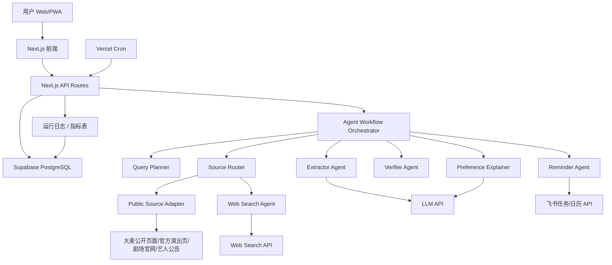
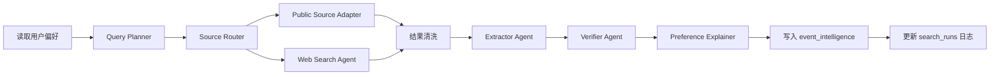
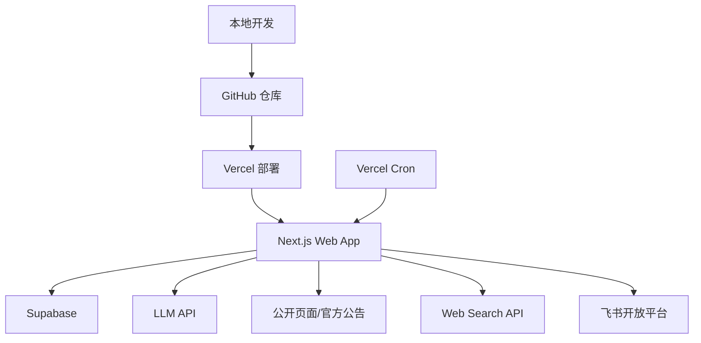

# 打工人的演出自救 Agent：技术架构设计

版本：v0.1  
日期：2026-05-11  
对应 PRD：`打工人的演出自救Agent_MVP_PRD.md`  
对应原型：`打工人的演出自救Agent_产品原型设计.md`

---

## 1. 架构目标

本项目的 MVP 架构需要同时满足两个要求：

1. 对非技术背景团队友好，避免过度复杂的微服务和基础设施。
2. 能体现比赛评分中的 AI 工程全链路：数据采集、治理、特征提取、Agent 编排、后端服务、前端交互、外部系统集成、可观测性。

因此 MVP 采用：

```text
Next.js 单体全栈应用
+ Supabase PostgreSQL
+ 公开页面与官方公告数据源适配器
+ Web Search API
+ LLM API
+ 飞书开放平台
+ Vercel 部署和 Cron
```

---

## 2. 总体架构



核心说明：

- 前端和后端都在一个 Next.js 项目中，降低部署和学习成本。
- Agent 编排先用代码工作流实现，不一开始引入复杂框架。
- 每个 Agent 模块保持独立文件，后续可迁移到 LangGraph。
- 所有运行过程写入数据库，支撑运行日志和比赛演示。
- MVP 主链路不调用大麦官方 API，而是优先使用大麦公开页面、官方演出页面、剧场官网和艺人公告；Web Search 用于多源补充。
- 架构上预留大麦官方授权接口适配层，未来获得企业或分销授权后可接入，但不作为当前版本依赖。

---

## 3. 技术选型

### 3.1 前端

推荐：

- Next.js App Router
- TypeScript
- Tailwind CSS
- shadcn/ui
- lucide-react
- Recharts

理由：

- Next.js 可以同时处理前端页面和后端 API。
- TypeScript 提升代码可维护性。
- Tailwind 和 shadcn/ui 可以快速做出高质感 Web App。
- Recharts 可用于运行日志和指标展示。

### 3.2 后端

推荐：

- Next.js Route Handlers
- Server Actions 可选
- Zod 做入参校验
- Supabase JS SDK

理由：

- 不额外引入 FastAPI 或 NestJS，降低复杂度。
- API 和页面放在一个项目中，适合 MVP。
- Zod 可以保证接口输入清晰，便于比赛展示代码质量。

### 3.3 数据库

推荐：

- Supabase PostgreSQL

理由：

- 比 SQLite 更适合在线部署和多用户扩展。
- 比自建 PostgreSQL 更省运维。
- 可以直接管理表、权限和环境变量。

### 3.4 Agent 与模型

推荐：

- LLM API：OpenAI API 或兼容模型 API。
- 公开页面与官方公告数据源：大麦公开页面、官方演出页面、剧场官网、艺人公告。
- 大麦官方授权接口：仅预留适配层，不在普通个人开发者 MVP 中启用。
- Web Search：Tavily / SerpAPI / Bing Search API 任选其一。
- 编排方式：自定义 TypeScript workflow。

MVP 暂不强制使用 LangChain / LangGraph，避免工程复杂度过高。设计时保留模块边界，后续可迁移。

### 3.4.1 大麦 API 可用性判断

调研结论：

- 官方文档中存在大麦相关开放接口，例如项目列表查询 `alibaba.damai.maitix.projectlists.query`、分销项目详情查询 `alibaba.damai.maitix.project.distribution.detail.query`、项目状态查询等。
- 这些接口属于“大麦票务云分销 API”，主要服务于商家、分销或授权项目；接口需要 TOP 公共参数，如 `app_key`、`sign`、`timestamp`、`v`，部分场景依赖授权项目。
- 该接口不能直接视为“普通开发者可自由调用的大麦消费者端全量搜索 API”。

架构决策：

- 当前 MVP 面向普通个人开发者，不直接调用大麦官方 API。
- MVP 主链路优先使用大麦公开页面、官方演出页面、剧场官网、艺人公告。
- Web Search 作为多源补充，用于发现更多公开来源和交叉验证。
- 设计 `DamaiOfficialAdapter` 作为预留模块，不接入当前主流程；未来获得官方授权后可启用。
- 不调用非官方抓包接口，不绕过登录、验证码或风控。

### 3.5 飞书集成

推荐：

- 飞书任务 API。
- 飞书日历 API。
- OAuth 授权或比赛 Demo 使用测试应用凭证。

MVP 可先支持：

- 创建飞书待办。
- 创建飞书日历事件。
- 记录同步状态。

---

## 4. 模块划分

推荐目录结构：

```text
app/
  page.tsx
  radar/page.tsx
  review/page.tsx
  reminders/page.tsx
  preferences/page.tsx
  logs/page.tsx
  api/
    preferences/route.ts
    search-runs/route.ts
    radar/run/route.ts
    events/route.ts
    events/[id]/decision/route.ts
    reminders/route.ts
    feishu/callback/route.ts

components/
  EventIntelCard.tsx
  ConfidenceBadge.tsx
  DecisionActions.tsx
  CreateReminderModal.tsx
  AgentRunTimeline.tsx
  PreferenceForm.tsx

lib/
  db/
    supabase.ts
    schema.ts
  agents/
    workflow.ts
    query-planner.ts
    source-router.ts
    public-source-adapter.ts
    damai-official-adapter.ts
    search-agent.ts
    extractor-agent.ts
    verifier-agent.ts
    preference-explainer.ts
    reminder-agent.ts
  services/
    public-sources.ts
    damai-official.ts
    web-search.ts
    llm.ts
    feishu.ts
  utils/
    date.ts
    normalize.ts
    scoring.ts
    logger.ts

types/
  event.ts
  preference.ts
  reminder.ts
  agent.ts
```

---

## 5. Agent 工作流设计

### 5.1 主流程



### 5.2 伪代码

```ts
export async function runRadarWorkflow(userId: string) {
  const run = await createSearchRun(userId);

  try {
    const preferences = await getUserPreferences(userId);
    const queries = await planQueries(preferences);
    await logStep(run.id, "query_planned", { queries });

    const sourcePlan = await planSources(preferences, queries);
    await logStep(run.id, "source_planned", sourcePlan);

    const publicSourceResults = await fetchPublicSources(sourcePlan.publicSources);
    await logStep(run.id, "public_sources_completed", {
      count: publicSourceResults.length,
      sources: sourcePlan.publicSources
    });

    const searchResults = await searchWeb(sourcePlan.webSearchQueries);
    await logStep(run.id, "web_search_completed", { count: searchResults.length });

    const candidates = await extractEvents([...publicSourceResults, ...searchResults]);
    await logStep(run.id, "extract_completed", { count: candidates.length });

    const verified = await verifyAndDeduplicate(candidates);
    await logStep(run.id, "verify_completed", { count: verified.length });

    const explained = await explainPreferenceMatch(verified, preferences);
    await saveEventIntelligence(explained);

    await finishSearchRun(run.id, {
      status: "success",
      generatedQueries: queries,
      resultCount: searchResults.length,
      extractedCount: candidates.length,
      dedupedCount: explained.length
    });

    return explained;
  } catch (error) {
    await failSearchRun(run.id, error);
    throw error;
  }
}
```

---

## 6. 子 Agent 设计

### 6.1 Query Planner

输入：

- 用户常驻城市。
- 周边城市。
- 关注关键词。
- 演出类型。
- 当前日期。

输出：

- 搜索 query 数组。

生成规则：

- 核心关键词 + 城市 + 开票。
- 演出类型 + 城市 + 预约。
- 关键词 + 巡演 + 年份。
- 周边城市 + 音乐节 / 脱口秀 / 音乐剧 + 早鸟票。

示例：

```json
[
  "草东没有派对 上海 巡演 开票 2026",
  "上海 音乐剧 开票 2026",
  "杭州 音乐节 早鸟票 2026",
  "上海 脱口秀 专场 开票"
]
```

### 6.2 Source Router

职责：

- 根据用户偏好、query 类型和来源可信度选择数据源。
- 优先检索大麦公开页面、官方演出页面、剧场官网、艺人公告。
- 对公开页面覆盖不足的部分，使用 Web Search 做多源补充和交叉验证。
- 将每个数据源的状态写入运行日志。

数据源优先级：

```text
P0：大麦公开页面、官方演出页面、剧场官网、艺人公告。
P1：Web Search API 返回的公开网页结果，用于多源补充和发现新来源。
P2：社交媒体、媒体报道、聚合站点，仅作为低可信补充，需要更高不确定性提示。
预留：大麦官方授权接口适配层，当前 MVP 不启用。
```

### 6.3 Public Source Adapter

职责：

- 面向公开可访问页面进行检索和内容提取。
- 优先处理大麦公开页面、官方演出页面、剧场官网、艺人公告。
- 将页面标题、摘要、正文、结构化片段转换为统一 `SourceResult`。
- 记录来源域名、来源类型、抓取时间和可访问状态。

可用字段参考：

- 项目名称。
- 分类。
- 艺人信息。
- 演出时间。
- 演出开售时间。
- 演出销售结束时间。
- 海报图。
- 票务/取票/限购说明。
- 退票规则。

注意：

- 不调用库存锁定、下单、出票、支付、座位锁定等交易相关接口。
- 不调用非官方抓包接口。
- 不使用用户大麦账号登录态。

### 6.3.1 Damai Official Adapter 预留层

职责：

- 仅作为未来官方授权后的扩展接口。
- 当前 MVP 不启用，不要求配置 `app_key` 或签名。
- 如果未来获得大麦或合作方授权，可将项目列表、项目详情、项目状态等接口输出转换为统一 `SourceResult`。

输出结构：

```ts
type SourceResult = {
  sourceKind:
    | "damai_public_page"
    | "official_event_page"
    | "venue_official_site"
    | "artist_announcement"
    | "web_search"
    | "social"
    | "damai_official_reserved";
  sourceStatus: "success" | "skipped" | "failed";
  title: string;
  snippet?: string;
  url?: string;
  rawPayload?: unknown;
  fetchedAt: string;
  fallbackReason?: string;
};
```

### 6.4 Web Search Agent

职责：

- 调用 Web Search API。
- 获取 title、snippet、url、published_at。
- 初步过滤明显无关结果。
- 过滤过旧结果。

输出结构：

```ts
type SearchResult = {
  query: string;
  title: string;
  snippet: string;
  url: string;
  publishedAt?: string;
  sourceDomain: string;
};
```

### 6.5 Extractor Agent

职责：

- 将搜索结果摘要或页面正文转换为结构化演出信息。
- 遇到缺失字段必须显式返回 null。
- 输出 uncertain_fields。

LLM 提示词原则：

- 只抽取文本中明确出现或可以可靠推断的信息。
- 不编造开票时间、场馆、价格。
- 不确定字段放入 `uncertain_fields`。
- 每条演出必须保留 `source_url`。

输出结构：

```ts
type EventCandidate = {
  sourceKind:
    | "damai_public_page"
    | "official_event_page"
    | "venue_official_site"
    | "artist_announcement"
    | "web_search"
    | "social"
    | "damai_official_reserved";
  eventName: string;
  category: string | null;
  city: string | null;
  venue: string | null;
  eventTime: string | null;
  reservationTime: string | null;
  ticketSaleTime: string | null;
  priceMin: number | null;
  priceMax: number | null;
  ticketPlatform: string | null;
  sourceUrl: string;
  sourceTitle: string;
  rawSourceId?: string;
  status: string | null;
  uncertainFields: string[];
};
```

### 6.6 Verifier Agent

职责：

- 去重。
- 合并来源。
- 计算可信度。
- 计算字段完整度。

去重规则：

- eventName 相似度。
- 城市一致。
- 演出时间接近。
- 艺人或剧目关键词一致。

MVP 简化实现：

- 先用规则归一化名称。
- 再用字符串相似度和城市字段合并。
- 后续可升级为 embedding 相似度。

可信度规则：

```text
大麦公开页面 / 官方演出页面：+40
剧场官网 / 艺人公告 / 主办方公告：+40
其他票务平台公开页面：+35
主流媒体：+30
社交平台公告：+20
聚合站或转述：+10

有明确开票时间：+20
有明确演出时间：+15
有明确场馆：+10
有票价：+10
多个来源相互印证：+15
大麦公开页面与官方公告交叉印证：额外 +10
```

### 6.7 Preference Explainer

职责：

- 给出参考标签。
- 生成匹配原因。
- 生成风险提示。
- 不自动创建提醒。

参考标签规则：

```text
推荐关注：
  命中关注关键词，城市匹配，且有明确开票/演出时间。

需要确认：
  类型或城市匹配，但关键字段缺失。

可能不适合：
  预算明显超出、城市过远、时间不匹配或可信度较低。
```

输出：

```ts
type EventExplanation = {
  recommendationLabel: "推荐关注" | "需要确认" | "可能不适合";
  matchReasons: string[];
  riskNotes: string[];
  confidenceScore: number;
  completenessScore: number;
};
```

### 6.8 Reminder Agent

触发条件：

- 用户点击创建提醒。

职责：

- 根据事件时间生成提醒计划。
- 调用飞书任务和日历接口。
- 写入 reminders 表。
- 返回同步状态。

提醒策略：

```text
有开票时间：
  开票前 1 天
  开票前 1 小时
  开票前 15 分钟

无开票时间：
  创建候补观察待办
  提醒用户补充或等待 Agent 后续发现

有演出时间：
  演出前 1 天提醒确认交通、证件、入场时间
```

---

## 7. 数据模型

### 7.1 user_preferences

```sql
create table user_preferences (
  id uuid primary key default gen_random_uuid(),
  user_id uuid not null,
  home_city text not null,
  nearby_cities text[] default '{}',
  favorite_keywords text[] default '{}',
  event_categories text[] default '{}',
  budget_min integer,
  budget_max integer,
  time_preference text[] default '{}',
  feishu_enabled boolean default false,
  created_at timestamptz default now(),
  updated_at timestamptz default now()
);
```

### 7.2 search_runs

```sql
create table search_runs (
  id uuid primary key default gen_random_uuid(),
  user_id uuid not null,
  run_status text not null,
  started_at timestamptz default now(),
  finished_at timestamptz,
  generated_queries jsonb default '[]',
  result_count integer default 0,
  extracted_count integer default 0,
  deduped_count integer default 0,
  error_message text
);
```

### 7.3 agent_run_steps

```sql
create table agent_run_steps (
  id uuid primary key default gen_random_uuid(),
  run_id uuid not null references search_runs(id),
  step_name text not null,
  step_status text not null,
  payload jsonb default '{}',
  error_message text,
  created_at timestamptz default now()
);
```

### 7.4 source_run_logs

```sql
create table source_run_logs (
  id uuid primary key default gen_random_uuid(),
  run_id uuid not null references search_runs(id),
  source_kind text not null,
  source_status text not null,
  request_summary jsonb default '{}',
  result_count integer default 0,
  fallback_reason text,
  error_message text,
  created_at timestamptz default now()
);
```

### 7.5 event_intelligence

```sql
create table event_intelligence (
  id uuid primary key default gen_random_uuid(),
  event_name text not null,
  normalized_name text,
  category text,
  city text,
  venue text,
  event_time timestamptz,
  reservation_time timestamptz,
  ticket_sale_time timestamptz,
  price_min integer,
  price_max integer,
  ticket_platform text,
  primary_source_kind text,
  source_urls text[] default '{}',
  source_type text,
  confidence_score integer default 0,
  completeness_score integer default 0,
  recommendation_label text,
  match_reasons text[] default '{}',
  risk_notes text[] default '{}',
  uncertain_fields text[] default '{}',
  status text,
  created_at timestamptz default now(),
  updated_at timestamptz default now()
);
```

### 7.6 user_event_decisions

```sql
create table user_event_decisions (
  id uuid primary key default gen_random_uuid(),
  user_id uuid not null,
  event_id uuid not null references event_intelligence(id),
  decision text not null,
  decision_reason text,
  decided_at timestamptz default now()
);
```

### 7.7 reminders

```sql
create table reminders (
  id uuid primary key default gen_random_uuid(),
  user_id uuid not null,
  event_id uuid not null references event_intelligence(id),
  reminder_type text not null,
  reminder_time timestamptz,
  feishu_task_id text,
  feishu_calendar_event_id text,
  sync_status text not null default 'pending',
  error_message text,
  created_at timestamptz default now(),
  updated_at timestamptz default now()
);
```

### 7.8 feishu_connections

```sql
create table feishu_connections (
  id uuid primary key default gen_random_uuid(),
  user_id uuid not null,
  open_id text,
  access_token_encrypted text,
  refresh_token_encrypted text,
  expires_at timestamptz,
  connection_status text default 'active',
  created_at timestamptz default now(),
  updated_at timestamptz default now()
);
```

---

## 8. API 设计

### 8.1 偏好接口

`GET /api/preferences`

返回当前用户偏好。

`POST /api/preferences`

保存偏好。

请求示例：

```json
{
  "homeCity": "上海",
  "nearbyCities": ["杭州", "南京"],
  "favoriteKeywords": ["草东没有派对", "五月天", "音乐剧"],
  "eventCategories": ["演唱会", "Livehouse", "音乐节", "脱口秀", "音乐剧"],
  "budgetMin": 0,
  "budgetMax": 800,
  "timePreference": ["周末优先", "工作日晚可接受"]
}
```

### 8.2 运行演出雷达

`POST /api/radar/run`

触发一次 Agent 搜索。

返回：

```json
{
  "runId": "uuid",
  "status": "success",
  "generatedQueries": [],
  "sourceSummary": {
    "damai_public_page": 9,
    "official_event_page": 3,
    "venue_official_site": 2,
    "artist_announcement": 4,
    "web_search": 86
  },
  "eventCount": 13
}
```

### 8.3 演出情报列表

`GET /api/events?status=new&label=推荐关注`

返回演出情报卡片列表。

### 8.4 用户决策

`POST /api/events/:id/decision`

请求：

```json
{
  "decision": "create_reminder",
  "decisionReason": "用户手动确认关注"
}
```

### 8.5 创建提醒

`POST /api/reminders`

请求：

```json
{
  "eventId": "uuid",
  "channels": ["feishu_task", "feishu_calendar"],
  "reminderOffsets": ["P1D", "PT1H", "PT15M"]
}
```

返回：

```json
{
  "syncStatus": "success",
  "feishuTaskId": "xxx",
  "feishuCalendarEventId": "yyy"
}
```

### 8.6 运行日志

`GET /api/search-runs`

返回最近运行列表。

`GET /api/search-runs/:id`

返回单次运行详情和步骤。

---

## 9. 飞书集成设计

### 9.1 授权方式

MVP 建议两种模式：

1. 比赛 Demo 模式：
   - 使用测试飞书应用。
   - 使用固定测试用户授权。
   - 保证演示稳定。

2. 正式模式：
   - 使用 OAuth。
   - 用户授权后保存 access token 和 refresh token。
   - token 加密存储。

### 9.2 创建飞书待办

待办标题：

```text
抢票提醒：草东没有派对 2026 巡演上海站
```

待办描述：

```text
开票时间：2026-05-18 12:00
演出时间：2026-06-20 19:30
票务平台：大麦
来源链接：https://example.com

这是由“打工人的演出自救 Agent”根据你的确认创建的提醒。
```

### 9.3 创建飞书日历

日历标题：

```text
开票：草东没有派对 2026 巡演上海站
```

时间：

- 开始：开票时间前 15 分钟。
- 结束：开票时间后 15 分钟。

描述：

- 演出信息。
- 购票平台。
- 来源链接。
- 合规说明：仅提醒，不自动抢票。

---

## 10. 可观测性设计

MVP 必须做简单但可见的监控。

### 10.1 运行日志

每次 Agent 运行都写入：

- run_id。
- 用户 ID。
- 开始和结束时间。
- 状态。
- query 列表。
- 搜索结果数。
- 抽取成功数。
- 去重后数量。
- 错误信息。

### 10.2 步骤日志

每个子 Agent 写入：

- step_name。
- step_status。
- payload。
- error_message。

### 10.3 前端指标面板

展示：

- 最近一次运行状态。
- 平均运行耗时。
- 抽取成功率。
- 字段完整率。
- 飞书同步成功率。

### 10.4 告警策略

MVP 简化：

- 如果最近一次运行失败，页面显示红色状态。
- 如果飞书同步失败，待办卡片显示重试按钮。
- 如果连续 3 次 Search API 失败，运行日志显示高优先级错误。

---

## 11. 质量控制机制

### 11.1 抽取质量

规则：

- 关键字段不得臆造。
- 缺失字段必须写 null。
- source_url 必须保留。
- event_time 和 ticket_sale_time 必须做日期合法性校验。

### 11.2 去重质量

规则：

- 同名、同城、时间接近时合并。
- 合并后保留多个 source_url。
- 不确定时不强行合并，标记需要确认。

### 11.3 用户决策质量

记录：

- 用户关注率。
- 用户忽略率。
- 创建提醒率。

用途：

- 后续优化 Query Planner。
- 优化参考标签阈值。

---

## 12. 安全与合规

### 12.1 数据来源

- MVP 优先使用大麦公开页面、官方演出页面、剧场官网、艺人公告。
- 使用 Web Search API 做公开网页多源补充和交叉验证。
- 大麦官方授权接口仅作为预留扩展层，当前版本不调用。
- 不访问需要登录的数据。
- 不绕过验证码、排队系统或反爬机制。
- 不使用非官方抓包接口作为生产依赖。
- 不自动下单或购票。

### 12.2 用户数据

- 用户偏好仅用于搜索和匹配。
- 飞书 token 加密存储。
- 用户可删除偏好、决策、提醒记录。
- 日志中不记录敏感 token。

### 12.3 外部链接

- 所有情报保留来源链接。
- 用户可点击来源自行核验。
- 低可信来源需要明确提示。

---

## 13. 部署架构



环境变量：

```text
NEXT_PUBLIC_SUPABASE_URL
NEXT_PUBLIC_SUPABASE_ANON_KEY
SUPABASE_SERVICE_ROLE_KEY
LLM_API_KEY
WEB_SEARCH_API_KEY
FEISHU_APP_ID
FEISHU_APP_SECRET
FEISHU_ENCRYPTION_KEY
CRON_SECRET
```

---

## 14. 开发里程碑

### Milestone 1：静态原型

目标：

- 完成高保真前端页面。
- 使用 mock 数据展示完整交互。

范围：

- 演出雷达。
- 偏好画像。
- 抢票待办。
- 运行日志。
- 创建提醒弹窗。

### Milestone 2：数据库和基础 API

目标：

- 接入 Supabase。
- 完成偏好、演出、决策、提醒、日志 API。

### Milestone 3：Agent Workflow

目标：

- 实现 Query Planner。
- 实现 Source Router。
- 接入公开页面与官方公告数据源适配器。
- 接入 Web Search API。
- 接入 LLM 抽取。
- 实现基础去重和解释。

### Milestone 4：飞书闭环

目标：

- 完成飞书授权或测试凭证配置。
- 创建飞书待办。
- 创建飞书日历。
- 前端展示同步状态。

### Milestone 5：比赛演示打磨

目标：

- 准备稳定 demo 数据。
- 准备运行日志样例。
- 优化加载、错误和空状态。
- 整理 README、方案文档和演示脚本。

---

## 15. 风险与降级方案

### 15.1 公开页面覆盖不足

原因：

- 某些演出尚未在大麦公开页面或官方页面发布。
- 剧场官网、艺人公告更新滞后。
- 页面结构变化导致抽取字段不完整。

降级：

- 在 Source Router 中标记 `fallback_to_web_search`。
- 使用 Web Search 补充其他平台、社交公告和媒体报道。
- 将字段缺失的情报进入“需要确认”状态。
- 不使用非官方抓包接口绕过授权。

### 15.2 Web Search API 不稳定

降级：

- 使用 mock 搜索结果。
- 保留运行日志，标明 Demo 数据来源。

### 15.3 LLM 抽取不稳定

降级：

- 限制输入长度。
- 增加 JSON schema 校验。
- 抽取失败时进入待确认状态。

### 15.4 飞书 API 配置复杂

降级：

- 先支持测试用户。
- 创建失败时展示待办详情和重试按钮。
- 保留本地站内待办。

### 15.5 时间字段错误

降级：

- 对无法解析的时间字段标记为不确定。
- 不自动创建精确时间提醒，改为候补观察。

---

## 16. 比赛评分映射

### 技术深度与创新性

- 票务情报检索 Skill 自动生成 query，并通过 Source Router 选择公开页面、官方公告和 Web Search 数据源。
- 架构预留大麦官方授权接口适配层，但 MVP 主链路不依赖授权 API。
- LLM 结构化抽取。
- Verifier Agent 去重和可信度评估。
- Preference Explainer 可解释参考。
- Human-in-the-loop 决策机制。

### 技术实现与工程完整度

- Next.js 全栈。
- Supabase 数据治理。
- Agent workflow。
- 多源数据接入和 source_run_logs 可观测日志。
- 飞书外部系统集成。
- Vercel Cron 定时任务。
- 运行日志和质量指标。

### 业务价值与场景契合度

- 解决真实的开票错过问题。
- 可扩展到校园社群和企业员工福利。
- 通过飞书待办进入真实工作流。

### 代码质量与文档

- TypeScript 类型定义。
- Zod 入参校验。
- 模块化 Agent 目录。
- PRD、原型、架构文档齐备。

### 数据与合规性

- 仅使用公开网页。
- 不自动抢票。
- 保留来源链接。
- 用户授权后才同步飞书。

### 项目材料完整度

- PRD。
- 产品原型文档。
- 技术架构文档。
- README。
- 演示脚本。
- 演示视频。

---

## 17. 大麦 API 调研参考

- 阿里/飞猪开放平台“大麦票务云分销 API”文档列出了项目列表、项目详情、项目状态、库存锁定、出票等接口，其中项目列表接口为 `alibaba.damai.maitix.projectlists.query`，说明为根据商家 appkey 查询授权项目列表。
- 分销项目详情接口 `alibaba.damai.maitix.project.distribution.detail.query` 返回项目名称、分类、艺人、演出时间、演出开售时间、演出销售结束时间、海报、限购、退票规则等字段，可作为未来合法授权场景下的高质量结构化来源。
- 这些接口需要 TOP 公共参数，包括 `method`、`app_key`、`sign_method`、`sign`、`timestamp`、`format`、`v` 等，不应被理解为无需授权的全量消费者端搜索能力。
- 当前 MVP 以普通个人开发者身份实现，不调用上述大麦开放接口，仅保留未来授权适配层。

参考链接：

- https://open.fliggy.com/docs/api.htm?apiId=42624
- https://open.fliggy.com/docs/api.htm?apiId=45916
